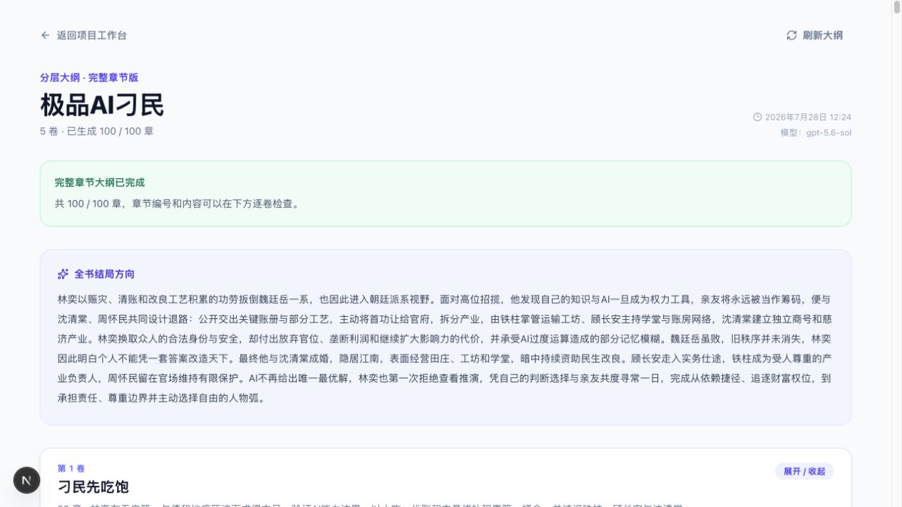

<p align="center">
  
</p>

# 小白作家

小白作家是一套面向新手作者的 AI 长篇小说创作系统。你负责提供创意和做出关键选择，系统负责整理故事圣经、规划长篇大纲、辅助逐章创作，并帮助小说持续推进到完结。

当前版本已经支持：

- 三步创建小说项目；
- AI 服务、模型地址和 API Key 设置；
- 故事圣经生成；
- 分卷、分章的长篇分层大纲；
- 场景表、正文草稿和章节定稿；
- 桌面端与手机 H5 小说预览；
- 小说项目 JSON 导入与完整备份导出；
- 账号注册、登录和会话管理，每个账号只读取自己的小说与 AI 设置；
- PostgreSQL 持久化存储。

## 功能预览

### 小说创作工作台

从首页管理小说项目、AI 模型配置和创作入口。


### 三步创建小说

通过通俗问题收集故事创意、主角目标和结局方向，无需预先掌握专业写作术语。


### 完整分层大纲

查看全书结局方向、分卷目标以及每章的目标、冲突、结果和状态变化。



### 章节创作工作台

按章节管理写作进度，在同一界面生成场景表、生成正文初稿、编辑和定稿。


### 沉浸式小说预览

以阅读模式预览已完成正文，支持目录、章节切换和阅读显示设置。


## 推荐：使用 Docker 一键部署

这是最简单的部署方式。只需要提前安装 [Docker Desktop](https://www.docker.com/products/docker-desktop/) 或 Docker Engine，并确保 Docker Compose 可用。

### 1. 启动

进入项目目录后运行：

```bash
docker compose up -d --build
```

Compose 会自动完成以下工作：

1. 启动 PostgreSQL；
2. 等待数据库可用；
3. 初始化或同步 Prisma 数据库结构；
4. 启动小白作家 Web 服务。

首次构建需要下载镜像和安装依赖，通常会比后续启动慢。服务启动后打开：

- 本机访问：[http://localhost:3000](http://localhost:3000)
- AI 设置：[http://localhost:3000/settings/ai](http://localhost:3000/settings/ai)

### 2. 查看状态和日志

```bash
docker compose ps
docker compose logs -f web
```

看到 Web 服务状态为 `healthy` 后即可使用。按 `Ctrl+C` 退出日志查看不会停止服务。

### 3. 停止或重新启动

```bash
# 停止服务，保留小说和设置数据
docker compose down

# 再次启动
docker compose up -d

# 拉取新代码后重新构建
docker compose up -d --build
```

PostgreSQL 数据保存在 Docker volume 中，普通的 `docker compose down` 不会删除数据。

> 注意：`docker compose down -v` 会同时删除数据库 volume，小说项目、正文和 AI 设置将无法恢复。除非明确需要清空数据，否则不要添加 `-v`。

### 4. 修改 Docker 数据库密码

默认账号和密码只适合本机体验。公网或服务器部署前，在项目根目录创建 `.env.docker`：

```dotenv
POSTGRES_USER=xiaobai
POSTGRES_PASSWORD=请替换为足够长的字母数字随机密码
POSTGRES_DB=xiaobai_writer
AUTH_BOOTSTRAP_TOKEN=请使用openssl-rand-hex-32生成高强度随机口令
```

启动时显式加载：

```bash
docker compose --env-file .env.docker up -d --build
```

`.env.docker` 不应提交到 Git，也不要把真实 API Key 写进镜像或 README。

连接字符串会直接使用这个密码；请使用字母和数字，避免 `@`、`:`、`/` 等需要 URL 编码的字符。

### 5. 配置 AI

部署完成后进入“AI 设置”页面，选择 OpenAI、OpenAI-compatible 或 LM Studio，并填写：

- API Base URL；
- 模型名；
- API Key。

设置会保存在 PostgreSQL 中，API Key 只由服务端读取，不会作为浏览器公开环境变量打包。

如果小白作家部署在远程服务器，而 LM Studio 运行在你自己的电脑上，容器中的 `localhost` 指向容器本身，不能直接访问电脑上的 LM Studio。此时需要使用容器可访问的局域网地址或中转服务地址。

## 资源受限服务器的安全部署

当服务器上已有其他重要服务时，不要在服务器执行 `docker compose up --build`。请使用 [docker-compose.server.yml](docker-compose.server.yml)，它只拉取 GitHub Actions 已经构建好的镜像，不会在服务器运行 npm、Next.js 或 Prisma 的镜像构建过程。

### 资源保护范围

| 服务 | CPU 上限 | 内存上限 | 进程数上限 |
| --- | ---: | ---: | ---: |
| Web | 0.75 核 | 768 MB | 256 |
| PostgreSQL | 0.35 核 | 384 MB | 128 |
| 数据结构同步 | 0.50 核 | 384 MB | 128 |

数据结构同步完成后才会启动 Web，因此正常运行时最多占用约 `1.10` 核和 `1152 MB` 内存。容器不能额外使用宿主机 Swap，日志限制为每个容器最多 3 个 10 MB 文件；如果发生全局 OOM，小白作家容器设置了更高的淘汰优先级，尽量保护服务器上的原有服务。

Web 默认只监听服务器回环地址 `127.0.0.1:3001`，不会与现有的 `3000` 服务冲突，也不会绕过 Nginx/Caddy 直接暴露到公网。

### 1. 由 GitHub 构建镜像

`.github/workflows/publish-ghcr.yml` 会在 `main` 分支更新后使用 GitHub Actions 构建 `linux/amd64` 镜像，并发布到：

```text
ghcr.io/980567039/xiaobai-writer:latest
ghcr.io/980567039/xiaobai-writer:migrator-latest
```

建议将这两个 GHCR Package 设置为 Public。如果保持 Private，需要先在服务器使用只具备 `read:packages` 权限的 GitHub Token 登录：

```bash
echo "$GHCR_TOKEN" | docker login ghcr.io -u 980567039 --password-stdin
```

不要把 Token 直接写进命令历史、Compose 文件或 Git 仓库。

### 2. 创建服务器环境变量

在服务器项目目录创建 `.env.server`：

```dotenv
POSTGRES_USER=xiaobai
POSTGRES_PASSWORD=请替换为足够长的字母数字随机密码
POSTGRES_DB=xiaobai_writer
APP_BIND_ADDRESS=127.0.0.1
APP_PORT=3001
XIAOBAI_IMAGE=ghcr.io/980567039/xiaobai-writer
```

AI API Key 推荐在部署完成后通过“AI 设置”页面保存，不要写进部署文件。

`AUTH_BOOTSTRAP_TOKEN` 只在首位站点所有者注册时使用。首位用户会原地接管升级前的本地作者账号，已有项目、章节、正文和 AI 配置的 ID 与内容都不会改变。初始化成功后，新用户正常注册，不再需要该口令。不要把它提交到 Git。

### 3. 只拉取并启动，不在服务器构建

```bash
docker compose --env-file .env.server -f docker-compose.server.yml pull
docker compose --env-file .env.server -f docker-compose.server.yml up -d
```

验证运行状态和资源限制：

```bash
docker compose --env-file .env.server -f docker-compose.server.yml ps
docker stats --no-stream
curl http://127.0.0.1:3001/api/health
```

确认应用健康后，再让现有 Nginx/Caddy 域名反向代理到 `http://127.0.0.1:3001`。停止小白作家时必须继续指定服务器 Compose 文件：

```bash
docker compose --env-file .env.server -f docker-compose.server.yml down
```

这不会停止其他 Compose 项目，也不会删除 PostgreSQL volume。不要添加 `-v`。

## 本地开发

### 环境要求

- Node.js 20.19 或更高版本；
- npm；
- PostgreSQL 14 或更高版本。

### macOS / Windows 一键启动

- macOS：双击 `scripts/start-mac.command`；
- Windows：双击 `scripts/start-windows.bat`。

详细说明见 [scripts/README.md](scripts/README.md)。

### 手动启动

复制环境变量示例：

```bash
cp .env.example .env
```

Windows PowerShell：

```powershell
Copy-Item .env.example .env
```

修改 `.env` 中的 `DATABASE_URL`，然后执行：

```bash
npm ci
npm run db:generate
npm run db:sync
npm run dev
```

打开 [http://localhost:3000](http://localhost:3000)。

## 常用命令

```bash
npm run dev              # 开发模式
npm run build            # 生产构建
npm run start            # 运行生产构建
npm run lint             # ESLint
npx tsc --noEmit         # TypeScript 检查
npm run test:ai-eval     # AI 固定评估
npm run test:auth        # 账号隔离集成测试（只允许独立测试库）
npm run db:validate      # 校验 Prisma Schema
npm run db:generate      # 生成 Prisma Client
npm run db:sync          # 初始化或同步数据库结构
npm run db:studio        # 打开 Prisma Studio
```

## 环境变量

| 变量 | 必填 | 说明 |
| --- | --- | --- |
| `DATABASE_URL` | 是 | PostgreSQL 连接字符串 |
| `AUTH_BOOTSTRAP_TOKEN` | 首次注册 | 首位所有者接管既有本地项目时使用的高强度口令 |
| `AI_PROVIDER` | 否 | 默认 `openai-compatible` |
| `AI_API_KEY` | 否 | 服务端 AI Key，也可在设置页保存 |
| `AI_BASE_URL` | 否 | OpenAI-compatible API 地址 |
| `AI_PLANNING_MODEL` | 否 | 故事圣经和大纲模型 |
| `AI_WRITING_MODEL` | 否 | 正文创作模型 |
| `AI_CHECK_MODEL` | 否 | 质量检查模型 |
| `APP_BIND_ADDRESS` | 否 | Docker 对外绑定地址，服务器建议 `127.0.0.1` |
| `APP_PORT` | 否 | Docker 对外端口，服务器默认 `3001` |
| `XIAOBAI_IMAGE` | 否 | 服务器部署使用的 GHCR 镜像名 |

`.env.example` 只提供安全的空值示例。不要提交包含真实密钥的 `.env`、`.env.docker` 或日志文件。

## 项目结构

```text
src/app/                 Next.js 页面与 API Routes
src/server/              数据库、AI Provider 和业务服务
prisma/                  数据模型与数据库迁移
scripts/                 macOS / Windows 一键启动脚本
tests/ai-evals/          AI 契约和固定评估
.github/workflows/       GitHub Actions 镜像构建
docker-compose.server.yml 资源受限服务器部署
docs/DEVELOPMENT_PLAN.md 产品与技术开发计划
```

更多设计和后续开发计划见 [docs/DEVELOPMENT_PLAN.md](docs/DEVELOPMENT_PLAN.md)。
