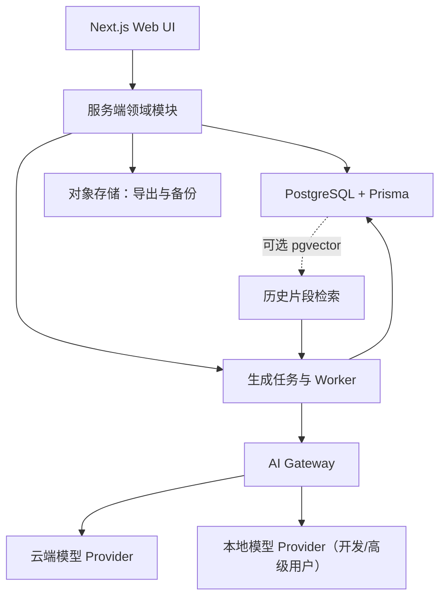
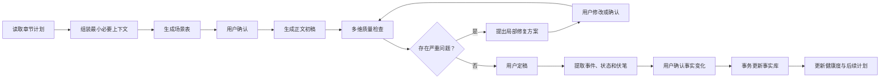

# 小白作家开发文档

> 文档版本：0.1
> 更新时间：2026-07-27
> 状态：MVP 设计稿，作为后续需求拆分、架构决策和验收依据

## 实施进度

截至 2026-07-27，第一批 M0 基础工作已完成：

- [x] 清理现有 TypeScript/ESLint 基线；
- [x] 建立 PostgreSQL 版 Prisma 领域 Schema；
- [x] 建立服务端 OpenAI-compatible Provider 接口；
- [x] 为人物提取、故事圣经、大纲和质量检查建立 Zod 输出契约；
- [x] 增加服务端环境变量示例并移除后续客户端密钥依赖的架构前提；
- [x] 安装 Prisma CLI，完成 Schema 校验与 `prisma generate`；
- [x] 生成 PostgreSQL 首份数据库迁移；
- [x] 将 Next.js 和 Prisma 升级至当前 npm 最新稳定版；
- [x] 建立项目创建 API、三步新手向导和基础项目工作台；
- [x] 建立 12 条 AI Eval 固定夹具及无依赖评测脚本；
- [x] 在本地 PostgreSQL 16 创建数据库并应用首份迁移；
- [x] 将首页从旧的 TXT 角色提取原型调整为小说工作台；
- [x] 增加 AI Provider 设置页、服务端保存和连接测试；
- [ ] 把真实模型/质量检查器接入 AI Eval 自动评分。

Prisma Client 已通过 PostgreSQL Driver Adapter 接入。本机 PostgreSQL 16 服务、`novel_role` 数据库和首份迁移均已就绪，项目创建 API 已完成实际写入与清理回归。

安全审计仍会从 Next.js 和 Prisma 的传递依赖中报告公告；当前 npm 最新稳定版尚无无破坏性的完整修复路径，因此没有执行 `npm audit fix --force` 所建议的错误降级。发布生产环境前必须再次复查并升级到包含修复的稳定版本。

## 1. 项目决策

### 1.1 结论

**继续使用当前仓库开发，不新建项目；在仓库内按新领域模型重构。**

这不是在现有页面上不断追加功能，而是把当前代码定位为 `0.1 UI/能力原型`，逐步替换其数据层和 AI 调用方式。除非后续明确改做 Tauri/Electron 纯桌面产品，或前后端由不同团队独立交付，否则不拆分新项目。

### 1.2 判断依据

当前项目已经具备可复用的工程外壳：

- Next.js 16、React 19、TypeScript、Tailwind CSS 4；
- App Router、基础页面布局和视觉样式；
- TXT 上传、文本分块和进度反馈；
- 小说切换、角色卡片和人物画像交互；
- LM Studio、ComfyUI 的本地开发代理思路；
- 完整 Git 历史和可运行的开发环境。

现有业务代码规模较小，替换核心逻辑的成本低。新建项目仍然要重新完成数据库、AI 编排、长期状态和质量检查等主要工作，同时会丢失已有 UI 和工程配置，因此不会降低开发成本。

### 1.3 复用与重建边界

| 范围 | 决策 | 说明 |
| --- | --- | --- |
| Next.js、React、TypeScript、Tailwind | 保留 | 适合先做模块化 Web 单体 |
| 上传和进度交互 | 改造复用 | 转为“导入已有小说”能力 |
| 角色卡和小说切换 UI | 改造复用 | 接入正式领域模型和数据库 |
| 文本分块 | 保留思路 | 移到服务端，并增加任务、重试和结构化校验 |
| `NovelContext` + `localStorage` | 替换 | 无法承载章节、版本和多端数据 |
| `src/lib/storage.ts` JSON 文件存储 | 删除 | 当前未接入，也不适合并发写入 |
| 客户端模型请求 | 替换 | 所有密钥和模型调用必须进入服务端 AI Gateway |
| 人物提取提示词和合并算法 | 重写 | 当前类型、输出和重要性计算不一致 |
| `next.config.ts` 本地模型代理 | 仅开发环境保留 | 生产环境不能依赖服务器的 `localhost` |

## 2. 产品定义

### 2.1 产品定位

> 用户负责想象和选择，系统负责规划、记录、检查和推进，帮助没有专业写作经验的用户完成一本阅读通顺、前后连贯、能够收束完结的长篇小说。

产品不承诺“一键生成文学名著”，第一阶段承诺的是降低长篇创作的组织难度：

- 用户不需要掌握人物弧、叙事节拍等专业术语；
- 重要人物、设定、物品和时间线不轻易冲突；
- 每一章有明确目标和状态变化；
- 创作偏离原计划后可以重新规划，而不是推倒重来；
- 系统主动追踪未完成主线、人物弧和伏笔；
- 故事进入后段后主动限制扩张并推动收束；
- 重要创作决策始终由用户确认。

### 2.2 目标用户

- 有故事想法但不会搭建大纲的新手；
- 经常写到中段卡住或弃坑的网文作者；
- 需要管理多人物、多线索和长时间线的创作者；
- 希望让 AI 辅助但不希望作品被 AI 完全接管的作者。

### 2.3 MVP 必须形成的闭环

1. 通过通俗问答创建小说；
2. 生成并编辑故事圣经；
3. 生成全书、分卷、章节和场景四层计划；
4. 组装本章必要上下文；
5. 生成场景表和正文初稿；
6. 自动检查一致性、人物、因果、节奏和文风；
7. 用户修改并确认章节定稿；
8. 从定稿正文提取事件、状态和伏笔；
9. 用户确认后更新正式事实库；
10. 更新后续计划与完结健康度；
11. 导出完整作品。

### 2.4 MVP 暂不包含

- 多人实时协作；
- 作者社区、作品发布和版权交易；
- 原生移动端或桌面端；
- 模型微调和作者文风训练；
- 自动封面、插图、有声书；
- 完全无人确认地生成整本小说；
- 复杂的版本分支合并；
- 阅读平台、订阅和内容分发能力。

## 3. 当前项目基线

### 3.1 已有能力

- `src/app/page.tsx`：上传 TXT，按约 10,000 字和 500 字重叠进行分块，逐块调用本地模型并合并人物；
- `src/app/results/page.tsx`：切换已分析小说，按重要程度展示人物；
- `src/components/CharacterCard.tsx`：展示人物资料、复制 SDXL 提示词、调用图片模型；
- `src/context/NovelContext.tsx`：在浏览器 `localStorage` 中保存分析结果；
- `next.config.ts`：把本地请求转发至 LM Studio 和 ComfyUI。

### 3.2 必须先解决的问题

1. 项目没有 Prisma Schema、正式数据库、服务端业务 API、任务系统和测试；
2. AI 流程集中在客户端页面，刷新后任务中断，无法重试和断点恢复；
3. `localStorage` 无法可靠保存几十万字正文、历史版本和结构化状态；
4. `Character` 类型要求 `personality`，但提取提示词没有输出该字段；
5. 人物重要性按跨文本块出现次数累加，不等价于叙事重要性；
6. 两个类型文件重复定义 `Character` 和 `ExtractionResult`；
7. `NEXT_PUBLIC_API_KEY` 在客户端使用会暴露模型密钥；
8. 模型 JSON 使用正则和 `JSON.parse` 解析，缺少 Schema 校验和失败恢复；
9. `@prisma/client` 已安装但没有真正接入；
10. README、页面标题和项目描述此前仍是 create-next-app 默认内容；
11. 当前 `npm run lint` 结果为 5 个错误、3 个警告，不能作为干净开发基线。

## 4. 核心设计原则

### 4.1 计划、草稿和事实严格分离

- 大纲表示“计划发生什么”；
- 草稿表示“AI 或用户正在尝试写什么”；
- 定稿表示“作品正文已经写了什么”；
- 只有从定稿正文提取并经用户确认的内容，才能进入事实库；
- AI 建议不能自动覆盖用户锁定的设定。

这是避免长期记忆被错误内容污染的第一原则。

### 4.2 结构化状态优先，语义检索辅助

生成章节时优先查询人物当前状态、世界规则、地点、时间、活跃故事线和应推进伏笔。向量检索只用于找回相关历史原文和语气参考，不能作为唯一记忆机制。

### 4.3 每章必须产生可验证的变化

章节计划必须至少改变一项状态：人物目标、关系、知识、资源、危险程度、故事线或伏笔状态。系统发现章节只有描述而没有变化时，应提示重构。

### 4.4 重要变更必须确认

以下操作只能生成建议，不能静默执行：

- 改变结局或核心人物动机；
- 新增一级支线或核心人物；
- 删除、合并大量后续章节；
- 写入与已锁定设定冲突的新事实；
- 将 AI 提取结果写入正式事实库。

### 4.5 所有 AI 能力可追踪、可回放、可替换

- 提示词、上下文组装器和输出 Schema 必须版本化；
- 保存模型、耗时、token、费用、输入摘要和输出；
- 业务代码只依赖统一 Provider 接口，不绑定单一模型厂商；
- 结构化输出失败只能有限重试，不能无限循环。

## 5. 新手用户体验与页面结构

### 5.1 主流程


### 5.2 推荐路由

| 路由 | 作用 |
| --- | --- |
| `/` | 产品入口或最近项目 |
| `/projects/new` | 新手创建向导 |
| `/projects/[id]` | 项目工作台与完结健康度 |
| `/projects/[id]/bible` | 故事圣经、人物、世界规则和关系 |
| `/projects/[id]/outline` | 全书、卷、章、场景计划 |
| `/projects/[id]/chapters/[chapterId]` | 章节编辑器与版本 |
| `/projects/[id]/canon` | 事实、时间线、人物状态和物品 |
| `/projects/[id]/threads` | 主线、支线、人物弧和伏笔 |
| `/projects/[id]/import` | 导入现有 TXT 并提取结构 |
| `/projects/[id]/export` | 导出 Markdown、TXT、DOCX |

界面默认只突出当前一步，高级数据和技术概念折叠展示。诸如“人物弧”可对用户显示为“这个人物最终要发生什么改变”。

## 6. 技术架构

### 6.1 总体选择

MVP 采用 **模块化单体 + 后台生成任务**，暂不拆微服务。



### 6.2 技术选择

| 层 | MVP 选择 | 说明 |
| --- | --- | --- |
| Web | Next.js App Router、React、TypeScript | 延续当前技术栈 |
| 样式 | Tailwind CSS | 延续当前技术栈 |
| 编辑器 | Tiptap 等成熟编辑器 | 不自行实现富文本内核 |
| 数据库 | PostgreSQL | 多用户、事务和 JSONB 更适合长期数据 |
| ORM | Prisma | 当前已有客户端依赖，补齐 Schema 与迁移 |
| 校验 | Zod / JSON Schema | 请求和模型输出共用明确契约 |
| 长任务 | `GenerationJob` + Worker | HTTP 只创建任务，不同步等待完整长任务 |
| 进度 | SSE | 展示阶段、增量文本、错误与取消状态 |
| 检索 | 结构化查询优先；pgvector 后置 | M0/M1 不必先引入向量检索 |
| 文件 | 对象存储 | 保存导出文件和必要备份 |
| 观测 | 错误追踪 + 模型调用指标 | 关注失败、耗时、token 和费用 |

生产公测前应使用可靠的队列基础设施；本地开发阶段允许进程内 Worker，但数据库任务记录必须从第一版存在，保证任务状态可恢复。

### 6.3 服务端模块

- `project`：项目、创建向导和成员权限；
- `bible`：创作规范、人物、关系、地点、组织和世界规则；
- `outline`：全书、分卷、章节、场景和大纲版本；
- `chapter`：正文、修订版本、定稿和编辑器保存；
- `canon`：正式事实、事件、状态快照和时间线；
- `thread`：主线、支线、人物弧和伏笔；
- `generation`：上下文组装、任务调度、Provider 和提示词；
- `quality`：一致性、因果、节奏、人物和文风检查；
- `health`：完结进度、风险和收束建议；
- `import-export`：已有作品导入和完整作品导出。

## 7. 核心数据模型

| 实体 | 作用 | 关键内容 |
| --- | --- | --- |
| `User` | 用户和权限 | 账号、偏好、额度 |
| `NovelProject` | 小说项目 | 标题、题材、目标字数、目标章节数、阶段 |
| `StoryBible` | 全书规范 | 主题、基调、视角、文风、禁用表达 |
| `Character` | 人物档案 | 欲望、恐惧、秘密、能力、说话特征 |
| `CharacterRelation` | 人物关系 | 类型、强度、公开状态、真实状态 |
| `WorldRule` | 世界规则 | 内容、适用范围、例外、是否锁定 |
| `Location` / `Organization` | 地点和组织 | 属性、成员、限制和关联事件 |
| `NarrativeArc` | 主线、支线或人物弧 | 目标、结束条件、状态和计划节点 |
| `VolumePlan` | 分卷计划 | 目标、高潮、结束条件、顺序 |
| `ChapterPlan` | 章节计划 | 目标、冲突、结果、必须变化、预计字数 |
| `ScenePlan` | 场景计划 | 角色目标、阻碍、行动、转折、结果 |
| `ChapterRevision` | 正文版本 | 内容、版本号、来源、定稿状态 |
| `StoryEvent` | 已发生事件 | 时间、地点、参与者、原因、结果、来源章节 |
| `CanonFact` | 已确认事实 | 主体、属性、值、有效区间、来源、锁定状态 |
| `StateSnapshot` | 章末状态 | 人物位置、情绪、伤势、知识、资源和物品 |
| `PlotThread` | 伏笔或悬念 | 埋设、推进、计划回收、实际回收和状态 |
| `QualityIssue` | 审校问题 | 类型、严重度、证据、建议、处理结果 |
| `GenerationJob` | AI 任务 | 类型、状态、模型、版本、成本、错误和结果 |
| `UserDecision` | 关键选择 | 选择、备选方案、影响范围和关联版本 |

所有可能由 AI 生成或修改的重要实体至少包含：

- `id`、`version`、`createdAt`、`updatedAt`；
- `createdBy`：`user | ai | system`；
- `status`：`suggested | confirmed | rejected`；
- `sourceChapterId` 或其他可追踪来源；
- `locked`，防止 AI 覆盖用户确认的信息。

`CanonFact` 需要支持有效起止章节。例如“角色持有宝剑”可能只在第 10 至第 23 章有效，历史状态不能被误认为当前状态。

## 8. AI 章节生产流水线



### 8.1 章节上下文包

每次生成前由服务端构建不可被客户端任意伪造的 `ChapterContextPackage`：

1. 本章目标、冲突和目标结尾状态；
2. 出场人物当前状态、信息边界和人物弧；
3. 当前时间、地点和适用世界规则；
4. 最近 2～3 章的结构化摘要；
5. 与本章相关的历史事件原文片段；
6. 本章应推进、可以回收和禁止提前回收的伏笔；
7. 文风、视角、篇幅和禁用表达；
8. 所有相关的锁定事实。

每一类设置 token 预算。不能简单把整本小说拼接进提示词。

### 8.2 AI 能力拆分

MVP 可以使用同一模型执行不同任务，但必须使用独立提示词和输出契约：

- 策划：故事圣经、大纲、场景表和重规划；
- 作者：正文初稿和指定片段改写；
- 连贯性编辑：事实、时间、地点、物品和信息边界；
- 人物编辑：动机、行为和说话方式；
- 节奏编辑：章节目标、冲突密度和重复内容；
- 文风编辑：视角漂移、套话和句式重复；
- 状态提取器：从定稿章节提取事件、事实、状态和伏笔。

### 8.3 质量问题输出契约

每个问题至少包含：

- 问题类型和严重等级；
- 对应正文证据；
- 冲突的已确认事实或计划；
- 影响范围；
- 最小修改建议；
- 是否允许自动修复。

只有措辞、错字和局部重复等低风险问题可以自动修复。涉及剧情、人物动机、世界规则和正式事实的问题必须由用户决定。

## 9. 完结机制

系统不能只显示一个不透明分数。完结健康度应展示：

- 主线、支线和人物弧完成比例；
- 已埋设但未推进、未回收的伏笔；
- 当前字数、目标字数和预测剩余章节；
- 本章实际结果与大纲计划的偏差；
- 尚未满足的结局条件；
- 故事继续扩张或无法收束的具体风险；
- 用户可以立即执行的调整建议。

当进度达到预计篇幅约 70% 时，逐步进入收束模式：

1. 限制新增核心人物和一级支线；
2. 为未闭合故事线安排结束章节；
3. 要求每个未回收伏笔拥有处理方案；
4. 每章至少推进一个结局条件；
5. 持续预测超长风险；
6. 偏离大纲时生成“保持原计划”和“接受新方向”两个方案；
7. 用户确认后创建新的剩余大纲版本，保留旧版本可恢复。

## 10. API 草案

长时间生成接口只返回 `jobId`，客户端通过 SSE 读取进度。写接口应支持幂等键，避免重复点击造成重复正文、事实或计费。

### 10.1 项目与创建向导

- `POST /api/projects`
- `POST /api/projects/:id/onboarding/answers`
- `POST /api/projects/:id/story-bible/generate`
- `PATCH /api/projects/:id/story-bible`

### 10.2 大纲

- `POST /api/projects/:id/outlines/generate`
- `GET /api/projects/:id/chapters`
- `PATCH /api/chapters/:id/plan`
- `POST /api/projects/:id/replans`
- `POST /api/replans/:id/confirm`

### 10.3 章节创作

- `POST /api/chapters/:id/scene-plan/generate`
- `POST /api/chapters/:id/drafts/generate`
- `POST /api/chapters/:id/quality-checks`
- `POST /api/chapters/:id/repairs`
- `POST /api/chapters/:id/finalize`

### 10.4 事实和状态

- `GET /api/projects/:id/canon`
- `POST /api/chapters/:id/fact-extractions`
- `POST /api/fact-extractions/:id/confirm`
- `GET /api/characters/:id/timeline`
- `GET /api/projects/:id/plot-threads`

### 10.5 任务

- `GET /api/jobs/:id`
- `GET /api/jobs/:id/events`
- `POST /api/jobs/:id/cancel`
- `POST /api/jobs/:id/retry`

## 11. 推荐代码目录

```text
src/
  app/
    api/
    projects/
  components/
    editor/
    novel/
    ui/
  server/
    ai/
      context/
      prompts/
      providers/
      schemas/
    modules/
      project/
      bible/
      outline/
      chapter/
      canon/
      thread/
      quality/
      health/
      import-export/
    jobs/
    db/
  types/
prisma/
  schema.prisma
  migrations/
tests/
  fixtures/
  integration/
  ai-evals/
docs/
```

约束：

- React 页面不得直接调用第三方模型 API；
- Prompt 不写在页面组件中；
- 数据库读写只通过服务端领域模块；
- AI 结构化结果通过 Zod/JSON Schema 校验后才能进入业务流程；
- `src/types` 不重复定义数据库和接口已有的类型；
- 本地模型和云端模型实现相同 Provider 接口。

## 12. 安全、隐私和成本

- 模型密钥只存放在服务端环境变量中，禁止使用 `NEXT_PUBLIC_*`；
- 数据库查询必须带用户和项目权限范围；
- 用户上传和正文不写入普通调试日志；
- 保存 AI 输入时优先存摘要、版本和哈希，确需保存全文时明确访问权限；
- 提供完整导出和永久删除项目的能力；
- 明确说明用户作品是否会发送给第三方模型、是否用于训练；
- 对生成接口做额度、速率和并发限制；
- 对不同任务使用分级模型，检查和抽取不默认使用最昂贵模型；
- 缓存章节摘要和上下文结果，只重写存在问题的片段。

建议的服务端环境变量命名：

```dotenv
DATABASE_URL=
AI_PROVIDER=
AI_API_KEY=
AI_BASE_URL=
AI_PLANNING_MODEL=
AI_WRITING_MODEL=
AI_CHECK_MODEL=
AI_EMBEDDING_MODEL=
OBJECT_STORAGE_ENDPOINT=
OBJECT_STORAGE_BUCKET=
```

仓库只提交 `.env.example`，不提交真实密钥。

## 13. 从当前原型迁移

迁移期间不要求一次删除全部旧代码，按以下顺序进行：

1. 修复现有 lint，建立干净基线；
2. 建立 Prisma Schema、数据库连接和正式领域类型；
3. 建立服务端 AI Gateway 与 Provider 接口；
4. 新建项目工作台、故事圣经、大纲和章节路由；
5. 将当前 TXT 上传页迁移为 `/projects/[id]/import`；
6. 把人物提取迁到后台任务，使用结构化输出；
7. 提供一次性浏览器数据导入，将旧 `localStorage` 角色卡转入数据库；
8. 新工作流稳定后删除 `NovelContext` 和未使用的 JSON 文件存储；
9. 将人物图片生成改为服务端 Provider；
10. 清理旧的本地代理规则，仅在显式本地模式启用。

迁移的任何阶段都不允许同时维护两套“正式事实来源”。数据库接入后，`localStorage` 只可用作未提交编辑草稿缓存。

## 14. 实施里程碑

### M0：工程与 AI 技术验证（1～2 周）

- 修复 lint，补齐格式化、单元测试和 CI；
- 建立 PostgreSQL、Prisma 和最小项目模型；
- 建立 AI Gateway、Provider、Prompt 版本和结构化输出；
- 准备 3～5 个测试故事及人工标准答案；
- 验证 10～20 章文本中的人物状态、事件和伏笔提取。

通过标准：结构化输出稳定合法，关键状态和事件可追踪到来源章节。

### M1：创作骨架（2～3 周）

- 新手创建向导；
- 故事圣经；
- 全书、分卷和章节大纲；
- 章节编辑器和自动保存；
- 基础生成任务和进度展示。

通过标准：新用户可在 15 分钟内建立项目，得到可编辑大纲和第一章。

### M2：章节闭环（2～3 周）

- 上下文包；
- 场景表确认；
- 正文生成和修订版本；
- 章节定稿；
- 状态提取和用户确认；
- 正式事实事务更新。

通过标准：连续完成至少 20 章，未定稿内容不会污染正式事实。

### M3：质量控制（2～3 周）

- 一致性、人物、因果、节奏和文风检查；
- 带证据的问题列表；
- 局部修复；
- 伏笔和故事线管理。

通过标准：固定测试集中，硬性矛盾检出率达到目标，且所有修改均可撤销。

### M4：完结能力（约 2 周）

- 大纲偏差分析；
- 剩余章节重规划；
- 完结健康度；
- 收束模式；
- Markdown、TXT、DOCX 导出。

通过标准：内部测试作品能够从创建持续推进至结局，主线、人物弧和伏笔都有明确结束状态。

### M5：小范围用户验证

重点观察：

- 创建项目后完成首章的比例；
- 完成 10 章、30 章的项目比例；
- AI 建议接受率、编辑率和撤销率；
- 每万字模型成本和平均等待时间；
- 每十章出现的严重矛盾数量；
- 进入收束阶段和最终完结的项目比例。

## 15. 测试与验收

### 15.1 自动化测试层次

- 单元测试：分块、上下文预算、状态转换、健康度和解析器；
- 集成测试：API、数据库事务、权限、幂等、取消和重试；
- AI Eval：固定输入、Schema 成功率、事实抽取和矛盾检出；
- E2E：创建项目 → 生成大纲 → 写章 → 定稿 → 状态确认 → 导出；
- 回归测试：Prompt、模型或上下文规则变化前后对比。

### 15.2 固定矛盾测试集

至少覆盖：

- 姓名、年龄、身份冲突；
- 人物无过渡地出现在另一地点；
- 已丢失或损坏的物品再次出现；
- 角色知道其不应该知道的信息；
- 能力违反世界规则；
- 时间线倒置；
- 伏笔提前揭晓或长期遗忘；
- 核心动机无事件推动地突然改变；
- 叙事视角和人称漂移；
- 连续章节重复相同冲突。

### 15.3 MVP 质量目标

- 结构化输出成功率不低于 99%；
- 固定测试集中的硬性事实矛盾检出率不低于 90%；
- 关键状态抽取准确率不低于 90%；
- 已锁定事实被自动覆盖次数为 0；
- AI 任务失败后可恢复，不产生重复正文和重复事实；
- 正文编辑不被后台检查阻塞；
- 所有 AI 建议均可接受、拒绝、编辑或撤销；
- 用户可以从任意定稿章节追踪到其造成的状态变化。

模型结果具有概率性，上述指标必须在固定 Eval 数据集上衡量，不能用单次演示判断。

## 16. 主要风险

| 风险 | 应对措施 |
| --- | --- |
| AI 长期记忆仍然出错 | 结构化事实、锁定、来源追踪、章后检查 |
| 错误抽取污染故事状态 | `suggested → confirmed` 两阶段提交 |
| 模型费用不可控 | 上下文预算、模型分级、摘要缓存、局部重写 |
| 生成等待过长 | 后台任务、SSE、阶段进度、取消和重试 |
| 检查误报过多 | 严重度、证据、忽略选项和用户偏好 |
| 新手被复杂页面吓退 | 单一主操作、通俗问答、高级信息折叠 |
| AI 过度主导创作 | 多方案展示，重要决策必须确认 |
| 故事无限扩张 | 目标章节、支线预算、收束模式和结束条件 |
| 模型供应商变化 | AI Gateway、Prompt 版本和回归测试 |
| 用户作品隐私或版权风险 | 数据最小化、清晰政策、删除与导出能力 |

## 17. 第一批开发任务

按依赖顺序执行，不并行修改同一基础模块：

1. 修复当前 lint 错误和重复类型；
2. 增加 `.env.example`，移除客户端密钥使用；
3. 建立 Prisma Schema：先实现 `NovelProject`、`StoryBible`、`Character`、`VolumePlan`、`ChapterPlan`、`ChapterRevision`、`GenerationJob`；
4. 建立数据库迁移和 Seed；
5. 实现 AI Provider 接口、一个云端实现和一个 OpenAI-compatible 本地实现；
6. 实现 Zod 输出契约、任务记录和错误恢复；
7. 实现新建项目向导与项目工作台；
8. 实现故事圣经生成、编辑和锁定；
9. 实现分层大纲与第一章生成；
10. 再进入状态提取、质量检查和完结健康度开发。

第一阶段最重要的不是继续美化角色卡，而是验证以下可靠闭环：

> 章节计划 → 上下文组装 → 正文生成 → 用户定稿 → 状态提取 → 事实确认 → 后续计划更新

这个闭环稳定以后，再增加图片、社区和更复杂的编辑体验。
